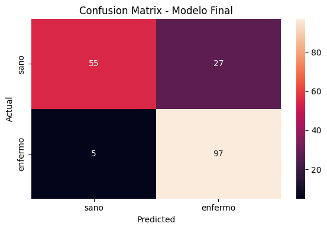
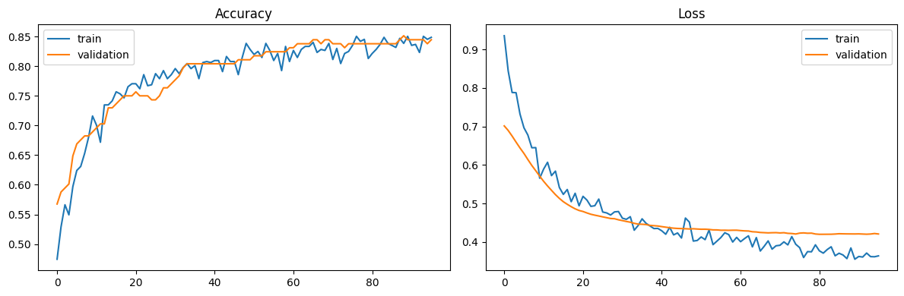
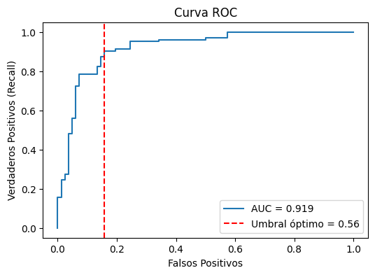
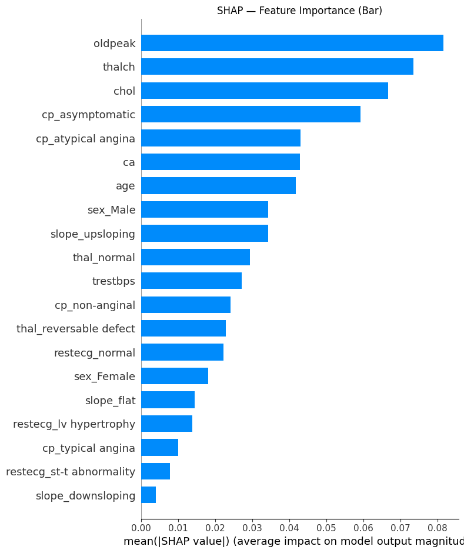
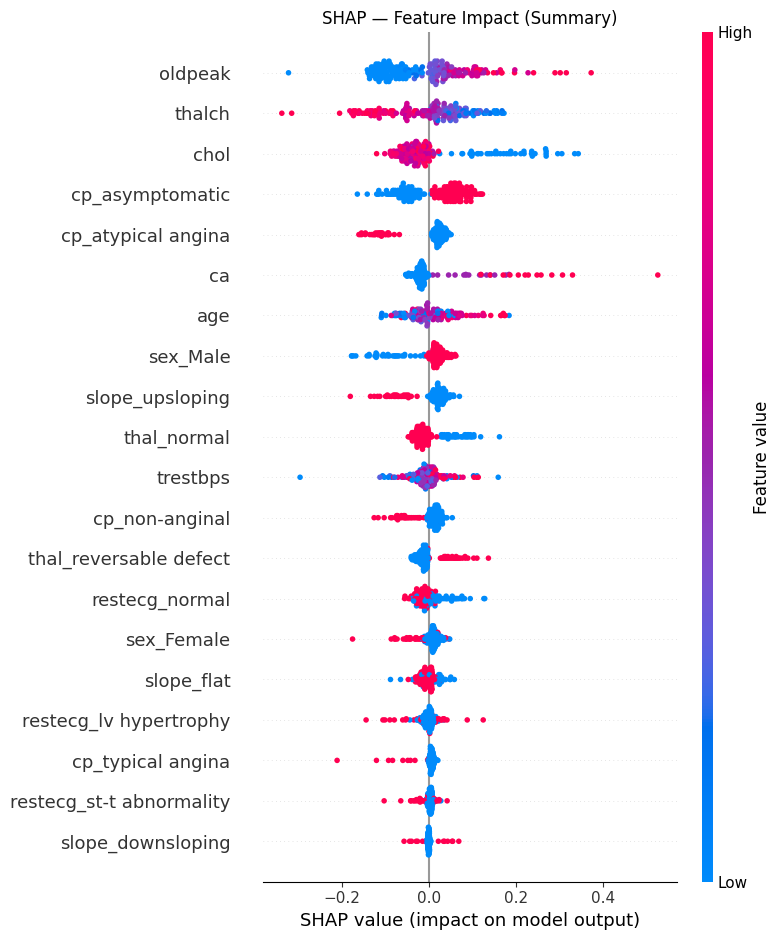

# 🫀 Heart Disease Neural Network Classifier

<div align="center">


</div>

---

> A binary classification model that predicts the presence of heart disease — built with a focus on **medical precision**: minimizing false negatives above all else.


---

# 🚀 Try It Live ### EN CONSTRUCCIÓN

<a href="https://huggingface.co/spaces/Ruben221b/iris-nn-classifier" target="_blank">👉 Test the model with your own data</a>


Enter your own sepal and petal measurements and get an instant prediction with confidence scores.

---

## 📌 Overview

This project trains a neural network on the [Heart Disease UCI Dataset](https://archive.ics.uci.edu/dataset/45/heart+disease) to classify patients as **healthy or diseased**. The original target has 5 severity levels (0–4), converted to binary following standard clinical practice — the intermediate grades are severely underrepresented and don't add predictive value at this scale.

The entire pipeline is optimized around a single medical truth: **telling a sick person they're healthy is far worse than the opposite.**

---

## 🧠 Model Architecture

```
Input (n_features)
    ↓
Dense → BatchNormalization → Dropout
    ↓
Dense → BatchNormalization → Dropout
    ↓
Dense(1, activation='sigmoid')
```

- **Loss:** Binary Crossentropy  
- **Optimizer:** Adam (tuned learning rate)  
- **Hyperparameter search:** Optuna (30 trials)  
- **Optuna objective:** Maximize recall of the "diseased" class  

---

## 🔁 Pipeline

| Step | Description |
|------|-------------|
| 🔧 **Preprocessing** | Null imputation, standard scaling for numerical features, one-hot encoding for categorical |
| 🔀 **Cross-validation** | 5-Fold Stratified KFold to estimate real-world performance |
| 🔍 **Hyperparameter tuning** | Optuna optimizes recall ≥ 0.95 on the validation set |
| 🧠 **Final model** | Trained with best params found, EarlyStopping on val_loss |
| 📊 **Evaluation** | Threshold automatically selected via ROC curve analysis |

---

## 📊 Results

| Metric | Value |
|--------|-------|
| **AUC** | 0.905 |
| **Recall (diseased)** | 95.1% |
| **Decision threshold** | ~0.352 |
| **False negatives** | 5 / 102 |
| **False positives** | 34 / 82 |

## 📊 Confusion Matrix



---

## 📈 Training Curves



---

## 📈 ROC Curve



---

## 🔍 SHAP Feature Importance




---

### Why not accuracy?

With a medical classifier, optimizing for accuracy treats both error types equally. A **false negative** (sick patient cleared as healthy) is clinically unacceptable. The decision threshold is chosen to guarantee **≥ 95% recall on the diseased class**, even at the cost of more false positives.

---

## 📈 ROC Curve & Threshold Selection

Rather than defaulting to 0.5, the threshold is selected programmatically: all thresholds from the ROC curve are evaluated and the one that achieves ≥ 95% recall with the lowest false positive rate is chosen automatically.

```python
candidatos = [(t, r, f) for t, r, f in resultados if r >= 0.95]
mejor = min(candidatos, key=lambda x: x[2])
```

---

## 🗂️ Dataset

**Heart Disease UCI** — 920 patients, 13 clinical features

| Feature | Description |
|---------|-------------|
| `age` | Age in years |
| `sex` | 1 = male, 0 = female |
| `cp` | Chest pain type (1–4) |
| `trestbps` | Resting blood pressure (mm Hg) |
| `chol` | Serum cholesterol (mg/dl) |
| `fbs` | Fasting blood sugar > 120 mg/dl |
| `restecg` | Resting ECG results |
| `thalch` | Max heart rate achieved |
| `exang` | Exercise-induced angina |
| `oldpeak` | ST depression induced by exercise |
| `slope` | Slope of peak exercise ST segment |
| `ca` | Number of major vessels (0–3) |
| `thal` | Thalassemia type |

---

## 🚀 Usage

### Install dependencies

```bash
pip install -r requirements.txt
```

### Load model and preprocessor

```python
import joblib
import tensorflow as tf

preprocessor = joblib.load('preprocessor.pkl')
model = tf.keras.models.load_model('heart_disease_model.keras')

# Predict
X_processed = preprocessor.transform(X_new)
prob = model.predict(X_processed).flatten()
prediction = (prob > 0.352).astype(int)
```

---

## 📁 Repository Structure

```
├── Proyecto_6.ipynb          # Full notebook
├── heart_disease_model.keras # Trained model
├── preprocessor.pkl          # Fitted preprocessor
├── requirements.txt
└── README.md
```

---

## 🔬 Key Learnings

- `argmax` is for multi-class output — binary sigmoid requires threshold comparison, not index selection
- The default 0.5 threshold is rarely optimal in real problems; always evaluate via ROC curve
- Optuna's default Youden index maximizes mathematical balance, not clinical priority
- With ~900 samples, simpler models (Random Forest, XGBoost) would likely be competitive — neural networks shine with more data

---

## 🛠️ Tech Stack


---

# ⭐ Support

If you found this project interesting:

- ⭐ Star the repository
- 🍴 Fork the project
- 🧠 Share suggestions
- 🚀 Contribute improvements

---

# 📬 Contact

## GitHub

```
https://github.com/Ruben221b
```

## LinkedIn

```
https://www.linkedin.com/in/rubendcuello/
```
